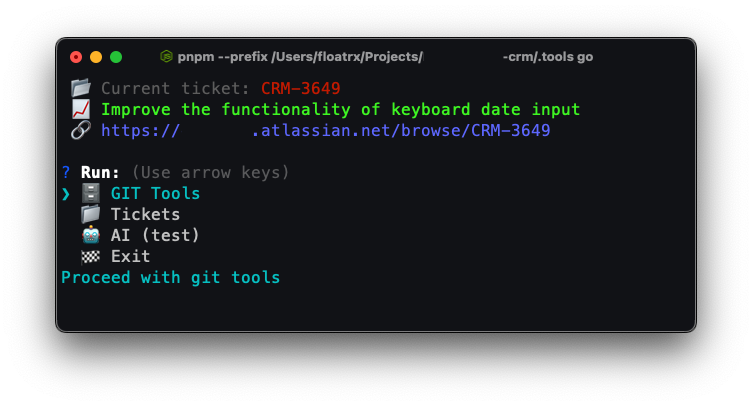

# Tools



### Prerequisites

1. Update global `~/.gitignore` to exclude the tools folder from the project.
   Add:

```
.tools
```

2. Clone this repo into the project's root folder.

```bash
git clone git@github.com:floatrx/.tools.git
```

### Init

Install dependencies (once) before using the tools.

```bash
cd .tools # from the root folder
pnpm i
```

### Run

See project's `package.json` for the list of available tools.

```bash
pnpm po
```

or add to your aliases (`.bashrc`, `.zshrc`, etc.):

> If you ask me, "Why `'po'`?", I can explain: the keys `"p"` and `"o"` are next to each other on the keyboard, and "po" is short for "project operations."

```bash
alias po="p --prefix /Users/${path-to-your-project}/.tools go"
```

Provide /Users path explicitly instead of using `~` to avoid issues with `pnpm`.

### Features

#### 🗄️ Git

- **Actualization**
    - Checkout
    - Fetch updates
    - Update npm dependencies
    - Rebuild types
- **Commit**
    - Select commit files
    - Generate and store commit message
    - Parse task number from commit message

### Ideas

- [x] 🗄️ Git (commit, checkout, fetch, update)
- [x] 📁 Tickets (create/remove)
- [ ] 🧠 AI (for commits & grammar fixes)
- [ ] 🗑️ Cleanup with `git checkout development && git branch | grep -v "development" | xargs git branch -D`
- [ ] Daily reports generator
